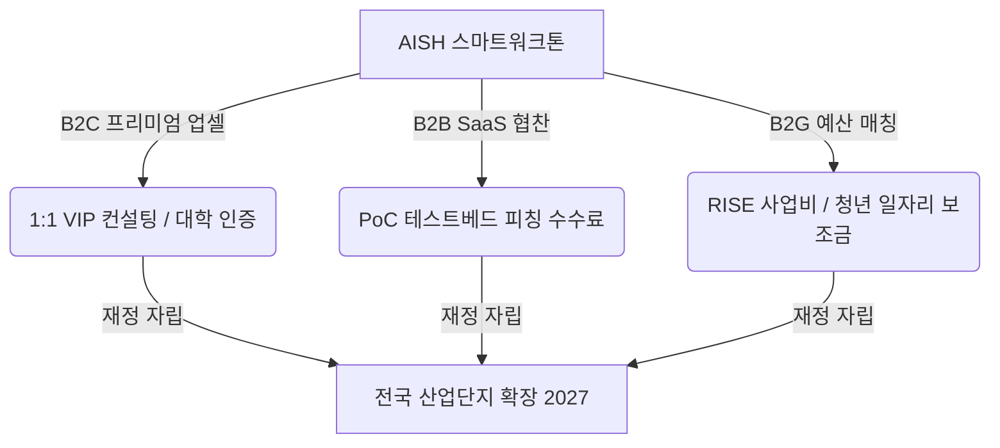

# AISH 스마트워크톤 지속가능 성장 전략 제안서 (개인전 부문)

> **AI 시대, 중소기업의 AX(AI 전환) 혁신과 스마트워크톤의 전국적 확장을 위한 수익모델 및 실행 로드맵**
> - **부문**: 개인전 (제출 규격: 3,000자 이내 자유 형식)
> - **제안자**: AI 전략 컨설턴트 에이전트

---

## 🎯 요약 및 제안 배경
본 제안서는 AISH의 핵심 가치인 **"배워서 남주자"**를 보존하면서, 참가비 30만 원 한도 내에서 운영비 상승 문제를 해결하고 재정적 자립을 도달하기 위한 **"이중 엔진(Dual-Engine) 성장 전략"**을 제시합니다. 

---

## 1. 스마트워크톤 핵심 자산 및 차별화 요소 (SWOT)

AISH 스마트워크톤은 단순한 교육 행사가 아닌, **G-Valley 중소기업 CEO 커뮤니티**와 **산학 협력 인프라**가 융합된 실행 플랫폼입니다.

| 항목 | 세부 분석 내용 |
| :--- | :--- |
| **S (강점)** | 김상용 대표원장의 13년 스마트워크 노하우, SBA 공공 신뢰도, 매주 화/수 밀착 네트워크 |
| **W (약점)** | 교육 참가비(30만 원)에만 의존하는 재원 구조, 전국 확장을 위한 가이드라인 부재 |
| **O (기회)** | 정부/지자체의 RISE 사업 및 AI-DX 예산 확대, SaaS 벤더들의 중소기업 마케팅 수요 폭증 |
| **T (위협)** | 단발성 AI 교육 범람, 경기 침체에 따른 중소기업의 DX 예산 감축 |

> [!NOTE]
> **핵심 차별화 요소 (UVP)**
> - 참가 CEO가 자사의 **실제 업무 데이터**를 지참하여 즉시 도입 가능한 AI 프로토타입을 구축하는 고밀도 현장 지향성.

---

## 2. 지속가능한 3-Way 수익 모델 (BM) 및 확장 전략

기존의 단일 참가비 구조에서 벗어나 **B2C, B2B, B2G**가 연계된 다각화된 수익 모델을 설계합니다.

### ① B2C (기존 참가비 유지 및 업셀)
* **기본 참가비 30만 원 유지**: 스마트워크 보급의 공익성을 위해 기본 진입 장벽은 그대로 유지합니다.
* **프리미엄 옵션**: 1:1 맞춤형 업무 자동화 시스템 아키텍처 설계를 제공하는 **'AISH VIP 컨설팅 패키지(추가 100만 원)'** 및 **'대학 공동 인증서'** 발급 비즈니스 모델 도입.

### ② B2B (SaaS 스폰서십 및 PoC 대행)
* **SaaS 기업 스폰서십 유치**: 중소기업 의사결정권자(CEO)를 타깃으로 마케팅하려는 SaaS 툴(Notion, Claude 등)의 스폰서십 광고 및 PoC 실증 테스트베드 수수료를 확보합니다.

### ③ B2G (지자체 예산 및 RISE 매칭)
* **대학 RISE 사업비 연계**: 서울시립대 및 동양미래대 산학협력단과 공동 주관하여 재직자 교육 지원 예산을 스마트워크톤 운영비와 매칭합니다.

> [!TIP]
> **API 비용 최적화 설계**
> - **프롬프트 캐싱 (Prompt Caching)** 및 **하이브리드 LLM 라우팅** 기법을 탑재하여, 전체 에이전트 시스템 운영에 소모되는 API 비용을 **최대 80% 이상 절감**합니다.

---

## 3. 공익성 vs 수익성 충돌 지점 및 보완 방안

* **충돌 지점**: 수익성 극대화 추구 시 참가비가 인상되어 영세 SME와 청년/시민 팀이 배제되고, 특정 협찬 도구의 과도한 마케팅으로 교육의 중립성이 훼손될 수 있습니다.
* **해결 방안 (이중 엔진 교차 보조)**:
  * B2B 후원금 및 B2G RISE 사업비로 대관료 및 청년 조교 수당을 전액 충당(**수익성 엔진**).
  * 수취한 B2C 참가비는 참가자들의 실습용 AI 크레딧 지원으로 100% 환원하고, 일반 대학생/시민 트랙은 전액 무료로 개방하여 공공성을 유지(**공익성 엔진**).

---

## 4. 2026년 제6회 핵심 아이디어: "G-Valley 상생 AX 챌린지"

> [!IMPORTANT]
> **핵심 아이디어 정의**
> - G-Valley 전통 제조·수출 기업의 실무 애로사항(문서 자동화, 메일 번역 등)을 접수받아, AISH 수료 CEO와 대학생이 한 팀이 되어 AI 자동화 솔루션 프로토타입을 구축해 주는 경진 행사.

### 👥 청년 조교 고용 모델
- **인력 풀**: 동양미래대 및 서울시립대 학생 대상 선발.
- **인건비 재원**: 지자체 '지역주도형 청년 일자리 보조금'과 대학 현장실습비를 결합하여 **정부 재원 100%**로 지급(시급 12,000원 상당).
- **역할**: 사전 AI 집중 교육 수료 후 해커톤 참가팀 1:1 기술 멘토 배치 ➡️ 매칭 기업 인턴십 및 취업 연계.

### 📅 2026 실행 타임라인
| 단계 | 기간 | 주요 실행 과제 |
| :--- | :--- | :--- |
| **1단계: 기획** | 7~8월 | 대학/지자체 공동 주최 MOU 체결, SaaS 스폰서십 유치 |
| **2단계: 접수** | 9월 | G-Valley 중소기업 대상 업무 자동화 애로사항 접수 |
| **3단계: 매칭** | 10월 | CEO-대학생 팀 빌딩, 청년 조교 배정 및 주 1회 보충 실습 |
| **4단계: 개최** | 11월 | 제6회 스마트워크톤 본선 개최, 성과 공유 및 우수작 상장 수여 |

### 🎯 기대 효과
* **SME**: 개발비 없이 자사 비즈니스에 즉시 적용 가능한 AI 자동화 PoC 확보.
* **청년**: 실제 기업 데이터를 가공해 본 포트폴리오 획득 및 로컬 기업 취업 기회.
* **공익 유지**: 지자체 공동 예산과 기업 기부 펀드를 결합하여 사회 공헌 우수 사례로 안착.
