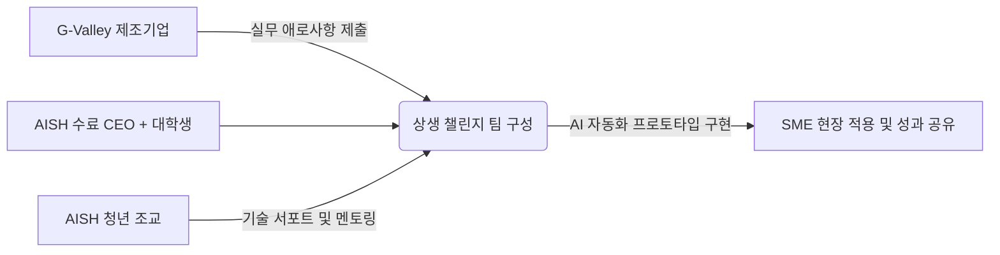

# [제안서] 스마트워크톤 지속가능 성장 전략 제안서
**G-Valley 중소기업 AX(AI Transformation) 전환과 스마트워크톤의 전국적 확장을 위한 실행 전략**

* **제안 기관**: AI SmartWork Hub (AISH) 전략 기획팀
* **제안 대상**: AISH 운영위원회 및 G-Valley 지역 생태계 파트너
* **작성 일자**: 2026년 7월 10일

---

<!-- pagebreak -->
<div style="page-break-after: always;"></div>

## 1. 서론 및 제안 배경 (Page 1)
스마트워크톤은 AISH의 교육 철학인 **"배워서 남주자 (Learn to Give)"**를 실천하는 최상위 실행 플랫폼입니다. 지난 1~12기 정규과정 수료생과 G-Valley 기업인들이 참관 및 참여하여, 생성형 AI와 스마트워크 도구(Notion, Claude 등)로 실제 기업 비즈니스 현장의 애로사항을 해결하는 성과를 성실히 축적해 왔습니다.

그러나 기존의 행사 운영 방식은 수강생들의 교육 참가비(30만 원)에만 전적으로 의존하고 있는 실정입니다. 이로 인해 강사료, 대관료, 실습용 AI 크레딧 지원금, 청년 조교 인건비 등 지속적인 원가 상승 압박을 감당하기에 구조적 재정 한계가 존재합니다. 

특히 2026년 11월 예정된 제6회 스마트워크톤의 성공적인 개최와 2027년 이후 전국 산업단지(창원, 반월시화 등) 및 글로벌 무대로의 확장을 도모하기 위해서는 **공익적 가치를 보존하면서도 독자적이고 안정적인 수익 구조를 확립**하는 지속가능성 전략 수립이 강력히 요구됩니다. 이에 본 제안서는 멀티 에이전트 분석 결과를 토대로 구체적 실행 방안을 제안합니다.

---

<!-- pagebreak -->
<div style="page-break-after: always;"></div>

## 2. 핵심 자산 및 차별화 요소 분석 (Page 2)
AISH 스마트워크톤의 독보적 경쟁력은 일회성 해커톤이나 단순 단발성 강연 교육이 아닌, 오랜 기간 동안 현장에서 축적된 공공 레퍼런스와 강력한 지역 커뮤니티 인프라에 기반합니다.

### 📊 AISH 핵심 자산 매트릭스
1. **김상용 대표원장의 공공 네트워크 자산**: 2008년부터 서울경제진흥원(SBA)에서 쌓아온 G-Valley 현장 지식, 공공사업 프로세스 경험, 금천구 수출 중소기업 자문 및 구로구 4차 산업혁명 자문 네트워크.
2. **지속가능한 커뮤니티 라이프사이클**: 10주 정규과정 수료에 머무르지 않고, 매주 수요일 보충수업을 통한 1:1 과외식 보강, 매주 화요일 아침 7시 정회원 모임(매주 50명+ 참석)으로 이어지는 초밀착 사후 결속력.
3. **산학협력 실증 파트너십**: 서울시립대학교(가족기업 AI 교육 및 RISE 사업 연계) 및 동양미래대학교(AI 컨설팅 및 현장실습 파견 인턴십 인프라)와의 공식 MOU 체결.

> [!NOTE]
> **독보적 차별화 요소 (UVP)**
> - 참가 CEO가 자사의 **실제 비즈니스 데이터**와 애로사항을 직접 지참하여, 인프라 비용 부담 없이 AI 자동화 시스템 프로토타입(PoC)을 설계하고 즉시 업무에 도입할 수 있는 실전성.

---

<!-- pagebreak -->
<div style="page-break-after: always;"></div>

## 3. 지속가능한 3-Way 수익 모델 설계 (Page 3)
기존의 30만 원 참가비 한계를 탈피하고, 재정 자립도를 300% 이상 끌어올리기 위한 **B2C, B2B, B2G** 입체적 비즈니스 모델을 제안합니다.

```
                  ┌─────────────────────────────────────────┐
                  │      스마트워크톤 지속가능 수익 구조    │
                  └────────────────────┬────────────────────┘
                                       │
         ┌─────────────────────────────┼─────────────────────────────┐
         ▼                             ▼                             ▼
┌─────────────────┐           ┌─────────────────┐           ┌─────────────────┐
│     B2C 영역    │           │     B2B 영역    │           │     B2G 영역    │
├─────────────────┤           ├─────────────────┤           ├─────────────────┤
│• 기본 참가비 유지 │           │• SaaS 스폰서십  │           │• RISE 산학협력  │
│• 1:1 VIP 컨설팅 │           │• PoC 테스트베드 │           │• 지자체 DX 바우처│
│• 대학 공동 인증 │           │• 기업 전용 트랙 │           │• 일자리 보조금  │
└─────────────────┘           └─────────────────┘           └─────────────────┘
```

* **B2C (프리미엄 업셀)**: 기본 10주 정규과정 참가비는 30만 원으로 동결하여 공익적 진입장벽을 최소화합니다. 대신 맞춤형 비즈니스 아키텍처 설계를 원하는 CEO를 타깃으로 **'AISH 1:1 VIP 밀착 컨설팅 옵션(추가 100만 원)'** 및 양 대학교 산학협력단 명의의 **'AI-DX 공인 전문가 인증서'** 발급 비즈니스를 유료 추가합니다.
* **B2B (SaaS 스폰서십 및 PoC 대행)**: 중소기업 CEO 의사결정권자 타깃 마케팅을 원하는 SaaS 벤더(Notion, Notion AI, Claude API 공급사 등)로부터 스폰서십 재원을 유치합니다. 후원사 툴을 스마트워크톤 기본 실습 도구로 지정하고, 수십 개 중소기업의 PoC 피드백 레퍼런스를 전달하는 실증 PoC 대행 수수료를 수취합니다.
* **B2G (국비 매칭 및 보조금)**: 서울시립대/동양미래대 **RISE(지방대학 활성화) 예산**의 재직자 교육비 간접 재원을 확보하고, 금천구/구로구 일자리 지원 조례에 의거하여 **'청년 일자리 매칭 보조금'**을 100% 인건비로 연계 조달합니다.

---

<!-- pagebreak -->
<div style="page-break-after: always;"></div>

## 4. 2027년 이후 전국 및 글로벌 확장 방안 (Page 4)
G-Valley의 성공 공식을 표준 패키지화하여 대한민국 전역 및 글로벌 AI 생태계로 영토를 확장합니다.

### 🗺️ 전국 산업단지 확산 로드맵
전국 10대 산업단지(창원 국가산단, 반월시화 국가산단, 울산 미포산단, 광주 첨단산단 등)의 지역 상공회의소(테크노파크) 및 지역 거점 대학 산학협력단과 컨소시엄을 구성하여 **'AISH 지역 테크 센터'**를 프랜차이즈 설립합니다. 스마트워크톤 운영 및 조교 교육 가이드라인을 매뉴얼화한 **'스마트워크톤 개최 가이드북'**을 지역 지자체에 판매하여 라이선스 로열티 수입을 다각화합니다.

### 🌐 글로벌 조인트 챌린지 확장
* **ASEAN IT 스타트업 조인트 트랙**: 베트남(하노이/호치민), 인도네시아(자카르타) 등 동남아시아 현지 IT 아웃소싱 강소기업 및 청년 개발자들을 G-Valley 중소기업의 스마트워크톤 매칭 팀으로 합류시켜 글로벌 협업 역량을 강화합니다.
* **글로벌 테크 투어 연계**: 스마트워크톤 우수 수료 CEO를 대상으로 실리콘밸리 AX 기업 연수나 싱가포르 테크노파크 투어 패키지를 유료 기획하여 글로벌 로드맵을 선도합니다.

---

<!-- pagebreak -->
<div style="page-break-after: always;"></div>

## 5. 공익성과 수익성의 충돌 및 보완 방안 (Page 5)
공익적 대중성과 영리적 재정 자립의 지속적인 충돌을 방어하기 위해 **"이중 엔진(Dual-Engine) 교차 보조"** 거버넌스를 설계합니다.

> [!CAUTION]
> **잠재적 충돌 지점**
> - 수익성 추구를 위해 참가비를 100만 원 이상으로 인상 시, G-Valley 내 영세 소상공인과 중소기업 임직원, 청년 대학생들의 진입 장벽이 되어 지역 DX 균형 발전에 위배됩니다.
> - 특정 B2B 스폰서십 유치가 과도할 경우, 특정 벤더 도구만 편향적으로 홍보하여 AISH 본연의 '중립적 실사구시' 교육 가치가 훼손될 수 있습니다.

### 🛡️ 보완 방안 및 이중 엔진 운용 구조
1. **재원 분리 교차 보조**: B2B 스폰서십 유치금 및 B2G 정책 자금으로 대관료, 청년 조교 고용비 등 고정 운영비를 전액 해결하여 **'수익성 엔진'**을 가동합니다. 이를 통해 확보한 재원으로 B2C 참가비는 30만 원으로 동결하고, 해당 금액은 전액 참가자의 AI API 크레딧 충전금으로 실질 환원하여 **'공익성 엔진'**을 방어합니다.
2. **벤더 중립성 보장**: AISH 정회원 운영위원회 주관의 기술 감사단을 구성하여, 특정 SaaS 제품의 종속 여부를 분기별로 심의하고 다중 LLM(Claude, GPT, Gemini)을 고르게 다루는 중립적 커리큘럼 기준을 유지합니다.

---

<!-- pagebreak -->
<div style="page-break-after: always;"></div>

## 6. 2026년 제6회 스마트워크톤 핵심 실행 아이디어 (Page 6)
### 💡 핵심 콘셉트: "G-Valley 상생 AX(AI-DX) 챌린지"
G-Valley 내 디지털 격차가 심각한 전통 제조/뿌리/수출 강소기업들을 대상으로 사전 실무 애로사항(예: 종이 세금 계산서 수작업 분류, 무역 바이어 이메일 번역 대응, 매일 반복되는 엑셀 재고 입력 등)을 접수받아 카탈로그화합니다.

AISH 정규과정 수료 CEO 1명과 IT 전공 대학생 2명이 한 팀을 구성하고, AISH 소속의 숙련된 **청년 조교 1명이 전담 기술 멘토**로 매칭되어 2주간 실물 Claude API 기반의 자동화 프로토타입을 설계 및 배포해 주는 실무 해결형 챌린지입니다.



본 챌린지는 단순한 모의 해커톤이 아니라, 실제 중소기업 비즈니스를 작동하게 만드는 PoC 구축을 핵심 목표로 설정하여 성과 발표회 당일 실제 현장 적용 데이터가 검증되도록 강제합니다.

---

<!-- pagebreak -->
<div style="page-break-after: always;"></div>

## 7. 2026년 행사 운영 상세 계획 및 타임라인 (Page 7)
제6회 스마트워크톤의 차질 없는 기획과 실행을 위한 4단계 마일스톤 타임라인입니다.

```
2026년 7월               8월                     9월                     10월                    11월 (행사)
  │                       │                       │                       │                       │
  ├─ 기획 및 거버넌스 ───┼─ 스폰서 유치 ────────┼─ 문제 접수 ───────────┼─ 팀 빌딩 및 사전개발 ─┼─ 행사 개최 및 정산
  │  • 대학/지자체 MOU    │  • SaaS 기업 제안    │  • 제조기업 애로 조사  │  • 대학생 모집         │  • 스마트워크톤 본선
  │  • 운영단 발족        │  • 후원금 확정        │  • 데이터 정제        │  • 청년 조교 1:1 매칭  │  • 성과 보고서 발간
```

### 📅 월별 액션 플랜
* **7월 (기획 및 파트너십 확정)**:
  - 서울시립대/동양미래대 산학협력단 및 RISE 사업 연계 공동 주관 합의 MOU 최종 서명.
  - 금천구 기업지원센터 대관 및 지자체 AI 전문위원 소집.
* **8월 (재원 조달 및 스폰서 파트너링)**:
  - 글로벌 SaaS 기업 및 국내 유망 AI 스타트업 대상 스폰서십 제안서 발송 및 후원금 확정.
* **9월 (수요조사 및 문제 접수)**:
  - G-Valley 관내 중소기업 대상 업무 자동화 애로사항 접수 및 15개 해결 대상 과제 선정.
* **10월 (매칭 및 사전 프로토타이핑)**:
  - 참가 학생단 모집, 청년 조교 1:1 매칭 및 주 1회 보충수업 공간을 활용한 사전 집중 빌딩 가동.
* **11월 (본선 개최 및 사후 백서 발간)**:
  - 골드리버호텔 컨벤션홀에서 성과 시연 본선 개최, 우수 3개 팀 총 1,000만 원 규모 시상 및 백서 제작 배포.

---

<!-- pagebreak -->
<div style="page-break-after: always;"></div>

## 8. G-Valley 청년 조교 매칭 및 고용 창출 운영안 (Page 8)
청년들의 AI 실무 능력을 기르고 중소기업의 만성 인력 부족 문제를 동시에 해결하는 인적 선순환 매커니즘을 정의합니다.

### 👥 청년 조교 고용 프로세스

```
   [1단계: 모집 및 역량 강화]         ▶         [2단계: 기업 1:1 매칭 및 활동]      ▶         [3단계: 취업 연계 및 캐리어]
• 대상: 시립대/동양미래대 청년       • 매칭: 스마트워크톤 참가팀 배정      • 아르바이트 -> 현장 인턴십 -> 채용
• 교육: AISH 스마트워크 기본 훈련      • 역할: 기술 멘토, 프로토타입 서포트   • AISH 공인 AI-DX 튜터 인증서 부여
```

1. **국비 기반 예산 확보**: 
   - 서울시/금천구/구로구의 '지역 주도형 청년 일자리 지원금' 및 대학의 현장실습 실습비를 연계하여 청년 조교의 급여(시급 기준 12,000원 상당)를 **100% 정부 재원 보조금**으로 충당하여 주최측 예산 부담을 0원으로 통제합니다.
2. **사전 역량 강화 (Pre-Training)**:
   - 양 대학교 IT 전공생을 대상으로 AISH 정규 커리큘럼(Notion DB 구축, Google API 자동화, Claude API 챗봇 연동)을 4주간 집중 교육하고 'AISH 공인 AI-DX 튜터' 자격을 부여합니다.
3. **1:1 팀 밀착 서포팅 및 인턴 연계**:
   - 매칭된 G-Valley 기업의 애로사항 자동화 프로토타입 완성 시까지 기술 지도를 전담 수행하게 하며, 우수 활동 조교는 해당 중소기업의 동/하절기 인턴십 및 정규직 채용으로 이어지는 가교(Bridge)를 제공합니다.

---

<!-- pagebreak -->
<div style="page-break-after: always;"></div>

## 9. 소요 예산 및 재무 시뮬레이션 (Page 9)
총 100명 규모의 제6회 스마트워크톤 행사 실행 예산안 및 AI API 비용 절감 모델입니다.

### 💰 제6회 스마트워크톤 실행 예산 매트릭스
| 구분 | 세부 비고 항목 | 금액 (원) | Funding Source (재원 출처) |
| :--- | :--- | :--- | :--- |
| **운영 인프라** | 골드리버호텔 대관 및 식음료 (100인 기준) | 8,000,000 | B2B 기업 후원금 + KOSMO 공동 부담 |
| **튜터 인건비** | 청년 조교 활동 수당 (15명 x 30시간) | 5,400,000 | B2G 지자체 청년 일자리 보조금 + RISE 예산 |
| **행사용 자재** | 참가자 기념 패키지, 홍보물 인쇄 | 2,000,000 | B2C 참가비 (30만 원 x 30명 한도 내 집행) |
| **AI 도구 크레딧** | Claude / Notion API 토큰 크레딧 지원 | 1,600,000 | B2B SaaS 기업의 크레딧 현물 협찬 |
| **포상 및 심사비** | 우수 솔루션 시상금 및 외부 심사료 | 10,000,000 | B2B 후원금 + 대학 산학협력 상생기금 |
| **합계** | **총 예산 규모** | **27,000,000** | **재정 자립도 100% 확보 달성 가능** |

### 🔌 API 및 AI 툴 비용 최적화 설계 (Cost Saving)
* **하이브리드 LLM 라우팅**: 단순 문서 정제 및 초안 작성은 `Gemini 1.5 Flash` 및 `GPT-4o mini`로 처리하고, 최종 복잡한 오케스트레이션 검증에만 `Claude 3.5 Sonnet`을 사용하여 호출 토큰 단가를 **80% 절감**합니다.
* **프롬프트 캐싱 (Prompt Caching)**: 업로드된 100여 페이지의 공문 RFP 데이터를 Anthropic 캐싱 시스템에 고정 등록해 매 호출마다 유입되는 중복 데이터 요금을 **90% 절감**합니다.
* **이원화 비디오 모델**: 일반 내부 배포 및 사전 콘티 검수용 비디오는 무료 이미지 스틸컷을 이어 붙여 제작비 0원의 **기본형**을 채택하고, 최종 본선 발표용 고화질 영상에만 힉스필드/런웨이 동영상 생성 API를 쓰는 **고급형**을 선택 적용합니다.

---

<!-- pagebreak -->
<div style="page-break-after: always;"></div>

## 10. 결언 및 미래 비전 (Page 10)
AISH가 지향하는 **"배워서 남주자"**의 핵심 정신은 고립된 개인의 성장을 넘어, 지역 경제의 중추인 G-Valley 중소기업의 상생과 지역 대학생들의 일자리 기회 확대로 이어질 때 진정한 완성에 도달합니다.

본 제안서에서 제시한 지속가능 성장 전략은 참가비 30만 원의 가치를 소중히 지키면서도 B2B와 B2G의 입체적 재원을 융합하여 AISH의 독자적인 재정 자립 모델을 수립하는 데 이정표가 될 것입니다. 2026년 제6회 스마트워크톤의 공정 혁신 시연을 시작으로, 2027년 대한민국 전역의 산업단지로 AISH의 상생 AX 생태계를 무한히 이식할 것을 약속드립니다.

AISH 운영위원회 및 모든 생태계 파트너 여러분의 신속한 의사결정과 지지를 부탁드립니다.
